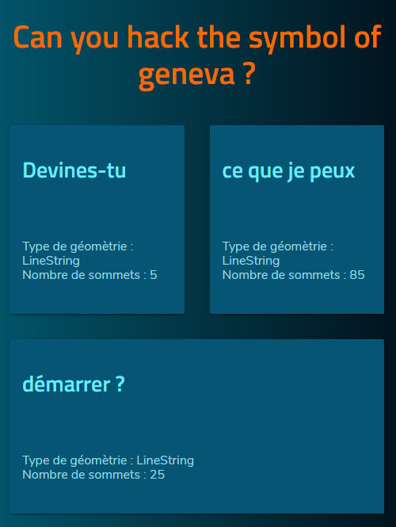
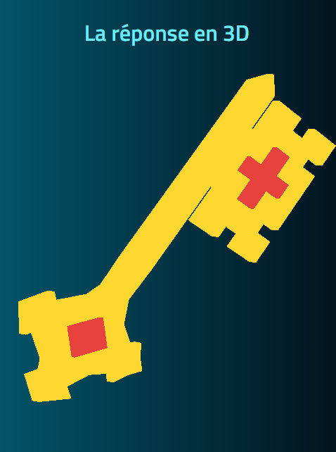

# Hackathon Front End

 

## 1. Prérequis pour l'exercice

  - Installation de NodeJS (node 10.15+ / npm 6.4+)
  - Installation de Aurelia CLI : [ Aurelia cli v1.3.1+](https://aurelia.io/docs/cli/basics#introduction)
  - Navigateur (Chromium)
  - [Visual Studio Code](https://code.visualstudio.com/)
  - Git [git-scm.com](https://git-scm.com/downloads)

## 2. Documentation générale
- Documentation Aurelia : [aurelia.io/docs](https://aurelia.io/docs)
- Aurelia UX package : [aurelia-ux](https://github.com/aurelia/ux)

## 3. Étapes d'initialisation

1. Clone repos
2. Installation package : `npm install`
3. Test de démarrage : `npm start`
4. Ouvrir nav. `http://localhost:8080` (le port peut être variable)

---

 
 

## 4. Hack #1

### > Objectif
Montrer son talent dans le maniement des objets HTML, CSS avec Aurelia.io

Le plus important, c'est d'appliquer les règles responsives et l'écriture CSS basées sur les conventions BEM.

Les couleurs et dimension des textes, objets ne doivent pas être exact pour la réussite de l'exercice.

### > Capture de l'exercice
 

 

### > Étapes

L'entier de l'exercice sera écrit dans `src/app.html, app.ts, app.css`.

1. Créer un Titre (h1) en orange dans une section, comportant la variable `message`
2. dans `app.ts` définir la variable `message` avec la propriété `name` du document `objects.ts`
3. Charger dans une variable de tableau les objets `features` du document `objects.ts`
4. Créer un élément `ux-card` pour chaque `features` dans `app.html`
5. Dans chaque `ux-card` charger la valeur de `feature.properties.name` , `feature.geometry.type` et le nombre de coordonnées `feature.geometry.coordinates`
6. Créer un fichier CSS `app.css` et le mettre en référence dans `app.html`
7. Ajouter dans le CSS les styles du texte, dégradé et couleurs, Google font `Titillium`
8. Ajouter les règles permettant aux cards d'être responsive.

 

 
 
 

---

## 5. Hack #2

### > Objectif
Montrer tes talents avec Three.js !

### > Capture de l'exercice

 

### > Étapes

L'entier de l'exercice sera écrit dans `src/app.html, app.ts, app.css`.

1. Installation du [package ThreeJS](https://threejs.org/)
2. Intégration du module dans la page `/src/app`
3. Création d'une forme extrudée de chaque objet `feature` en utilisant les coordonnées dans `feature.geometry.coordinates` du fichier `src/objects.json` avec la hauteur d'extrusion selon la clé `feature.properties.height`
4. Import et activer le contrôle `OrbitControls`
5. Déplacer et mettre à l'échelle les objets pour les voir à l'écran.

 

 

## 6. Hack #3 **bonus**

Question : Trouver ce que la clé peut démarrer ?

Indice : La réponse se trouve au centre de la croix rouge !

